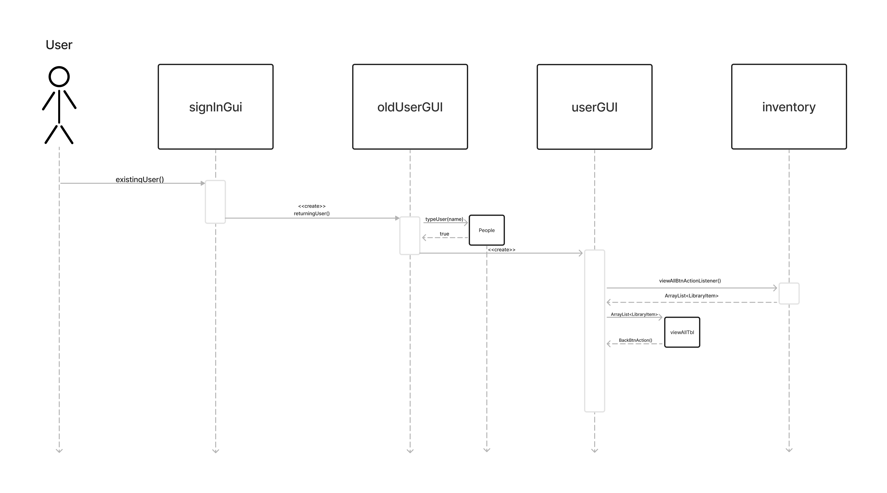

# Library Service App

## Concept

### Class Diagram

### Use Case Diagram

### Login as new user Sequence Diagram

### Login as existing user Sequence Diagram

### Borrow item Sequence Diagram

### Return Item Sequence Diagram

### View All Sequence Diagram

### Add Item Sequence Diagram

### Delete Item Sequence Diagram

### List Request Item Sequence Diagram

